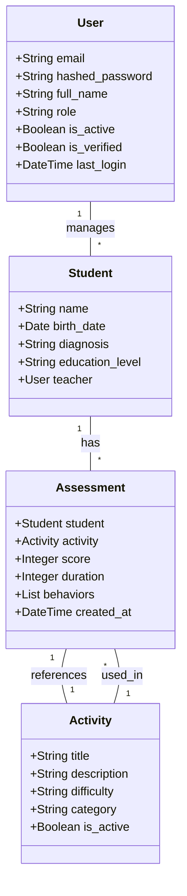

# 📊 Modelos de Banco de Dados

## Estrutura dos Modelos



## Detalhamento dos Modelos

### User (`user.py`)

Representa usuários do sistema (professores, administradores, pais, terapeutas).

#### Campos
| Campo | Tipo | Descrição |
|-------|------|-----------|
| email | String | Email único para autenticação |
| hashed_password | String | Senha criptografada (bcrypt) |
| full_name | String | Nome completo do usuário |
| role | Enum | Papel: admin, teacher, parent, therapist |
| is_active | Boolean | Status da conta |
| is_verified | Boolean | Status de verificação do email |
| last_login | DateTime | Data/hora do último acesso |

#### Relacionamentos
- `students` - Lista de estudantes associados (para professores)
- `assessments` - Avaliações criadas pelo usuário

### Student (`student.py`)

Representa estudantes/alunos no sistema.

#### Campos
| Campo | Tipo | Descrição |
|-------|------|-----------|
| name | String | Nome do estudante |
| birth_date | Date | Data de nascimento |
| diagnosis | String | Diagnóstico/condição |
| education_level | String | Nível educacional |
| teacher_id | ForeignKey | ID do professor responsável |

#### Relacionamentos
- `teacher` - Professor responsável (User)
- `assessments` - Lista de avaliações do estudante

### Activity (`activity.py`)

Representa atividades pedagógicas disponíveis.

#### Campos
| Campo | Tipo | Descrição |
|-------|------|-----------|
| title | String | Título da atividade |
| description | String | Descrição detalhada |
| difficulty | Enum | Nível: easy, medium, hard |
| category | String | Categoria pedagógica |
| is_active | Boolean | Status de disponibilidade |

#### Relacionamentos
- `assessments` - Lista de avaliações desta atividade

### Assessment (`assessment.py`)

Registra avaliações/resultados de atividades.

#### Campos
| Campo | Tipo | Descrição |
|-------|------|-----------|
| student_id | ForeignKey | ID do estudante |
| activity_id | ForeignKey | ID da atividade |
| score | Integer | Pontuação obtida |
| duration | Integer | Duração em segundos |
| behaviors | ARRAY | Lista de comportamentos observados |
| created_at | DateTime | Data/hora da avaliação |

#### Relacionamentos
- `student` - Estudante avaliado
- `activity` - Atividade realizada

## Convenções e Boas Práticas

### Nomenclatura
- Nomes de tabelas em snake_case
- Campos em snake_case
- Classes em PascalCase
- Relacionamentos em snake_case

### Validações
- Campos obrigatórios definidos com `nullable=False`
- Restrições de unicidade quando aplicável
- Validações de tipo e formato
- Índices em campos frequentemente consultados

### Migrations
- Use Alembic para todas as alterações
- Uma migration por alteração
- Documente alterações breaking
- Inclua rollback procedures

## Exemplos de Uso

### Criando um Usuário
```python
user = User(
    email="professor@eduautismo.com",
    full_name="João Silva",
    role="teacher",
    is_active=True
)
user.set_password("senha123")
await db.session.add(user)
await db.session.commit()
```

### Criando um Estudante
```python
student = Student(
    name="Maria Santos",
    birth_date=date(2015, 5, 15),
    diagnosis="TEA - Nível 1",
    education_level="elementary",
    teacher_id=user.id
)
await db.session.add(student)
await db.session.commit()
```

## Troubleshooting

### Problemas Comuns

1. **Erro de Chave Única**
   - Verifique duplicatas em campos únicos
   - Confirme se o registro não existe

2. **Erro de Chave Estrangeira**
   - Verifique se o registro pai existe
   - Confirme a ordem de deleção

3. **Erro de Validação**
   - Verifique o formato dos dados
   - Confirme campos obrigatórios

## Links Relacionados

- [Documentação SQLAlchemy](../backend/sqlalchemy.md)
- [Guia de Migrações](../backend/migrations.md)
- [Padrões de Código](../guides/coding-standards.md)