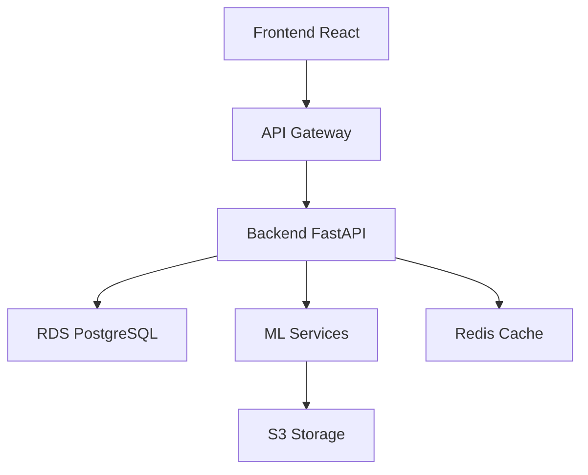

# 🏗️ Arquitetura do Sistema

Este documento descreve a arquitetura do sistema EduAutismo IA, incluindo seus componentes, interações e decisões técnicas.

## Visão Geral

O EduAutismo IA é uma plataforma distribuída que utiliza microserviços e processamento em nuvem para fornecer suporte pedagógico inteligente para alunos com TEA.

## Componentes Principais

### API Backend (FastAPI)

- Gerenciamento de usuários e autenticação
- Processamento de atividades e avaliações
- Integração com serviços de ML
- Persistência de dados

### Frontend (React)

- Interface responsiva e acessível
- Componentes adaptáveis
- Gestão de estado com React Query
- Temas personalizáveis

### Machine Learning

- Classificação comportamental
- Sistema de recomendação
- Processamento de linguagem natural
- Análise de padrões

### Infraestrutura AWS

- ECS para containerização
- RDS para banco de dados
- S3 para armazenamento
- CloudWatch para monitoramento

## Diagrama de Arquitetura

## Fluxo de Dados

1. Cliente faz requisição via frontend
2. API Gateway roteia a requisição
3. Backend processa e valida
4. Interação com ML se necessário
5. Persistência no banco de dados
6. Resposta ao cliente

## Decisões Técnicas

### Backend

- FastAPI pela performance e tipagem
- SQLAlchemy para ORM
- Alembic para migrações
- JWT para autenticação

### Frontend

- React com Vite
- TailwindCSS para estilização
- React Query para cache
- TypeScript para type safety

### Machine Learning

- PyTorch para modelos
- Scikit-learn para preprocessing
- NLTK para NLP
- FastAI para transfer learning

### Infraestrutura

- Docker para containerização
- Terraform para IaC
- GitHub Actions para CI/CD
- AWS para cloud

## Considerações de Segurança

- Autenticação JWT
- HTTPS em todas as comunicações
- Sanitização de inputs
- Rate limiting
- Backup automático
- Logs centralizados

## Escalabilidade

- Containers auto-escaláveis
- Cache distribuído
- Load balancing
- Database sharding
- CDN para assets

## Monitoramento

- Métricas de performance
- Logs de aplicação
- Alertas automáticos
- Dashboards em tempo real
- Rastreamento de erros

## Links Relacionados

- [Guia de Desenvolvimento](./development-guide.md)
- [Documentação da API](./api-docs.md)
- [Guia de Deploy](./deployment-guide.md)
- [Documentação ML](./ml/README.md)