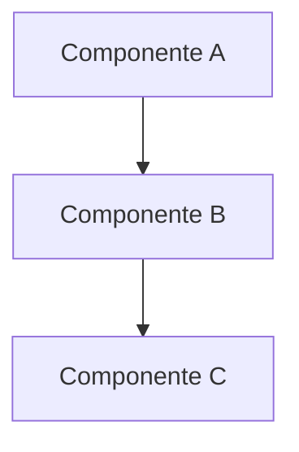

# Documentação Técnica: [Nome do Componente]

## Visão Geral

[Descrição técnica do componente, seu propósito e funcionalidade principal]

## Especificações Técnicas

### Tecnologias Utilizadas

- Linguagem: [ex: Python 3.11+]
- Framework: [ex: FastAPI]
- Dependências principais:
  - Dependência 1
  - Dependência 2

### Arquitetura



## Interface/API

### Endpoints/Métodos

#### Método 1

```python
def metodo_1(param1: str, param2: int) -> Result:
    """
    Descrição do método
    
    Args:
        param1: descrição
        param2: descrição
        
    Returns:
        Result: descrição do retorno
        
    Raises:
        Exception: descrição das exceções
    """
    pass
```

## Configuração

### Variáveis de Ambiente

| Variável | Descrição | Obrigatória | Padrão |
|----------|-----------|-------------|---------|
| VAR_1 | Descrição | Sim | - |
| VAR_2 | Descrição | Não | valor |

### Dependências

```bash
pip install -r requirements.txt
```

## Uso

### Exemplo Básico

```python
# Exemplo de uso básico
```

### Casos de Uso Comuns

1. Caso de uso 1
   ```python
   # Código do caso de uso 1
   ```

2. Caso de uso 2
   ```python
   # Código do caso de uso 2
   ```

## Performance

### Métricas

- Tempo de resposta médio: XX ms
- Throughput: XX req/s
- Uso de memória: XX MB

### Limitações

- Limitação 1
- Limitação 2

## Segurança

### Considerações

- Autenticação
- Autorização
- Rate limiting
- Validação de entrada

### Boas Práticas

- Prática 1
- Prática 2

## Troubleshooting

### Problemas Comuns

#### Problema 1

**Sintoma**: Descrição do sintoma

**Causa**: Explicação da causa

**Solução**: Passos para resolver

## Testes

### Unitários

```bash
pytest tests/unit
```

### Integração

```bash
pytest tests/integration
```

## Implantação

### Pré-requisitos

- Requisito 1
- Requisito 2

### Procedimento

1. Passo 1
2. Passo 2
3. Passo 3

## Monitoramento

### Métricas Principais

- Métrica 1
- Métrica 2

### Logs

```python
logging.info("Exemplo de log")
```

## Manutenção

### Tarefas Regulares

- [ ] Tarefa 1
- [ ] Tarefa 2

### Atualizações

- Procedimento de atualização
- Política de versionamento

## Referências

- [Link 1](url1) - Documentação oficial
- [Link 2](url2) - Artigos relacionados

## Histórico de Versões

| Versão | Data | Autor | Mudanças |
|--------|------|-------|----------|
| 1.0.0  | Data | Autor | Inicial  |